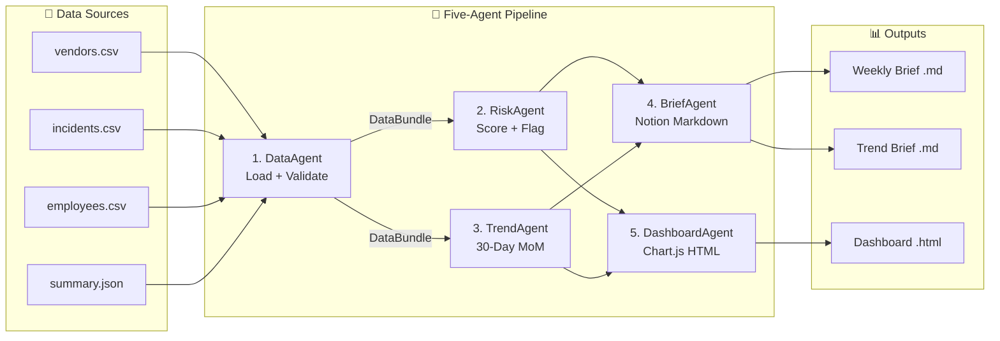

# IndiBrew GCC Vendor Risk Monitor

[](https://python.org)
[](LICENSE)
[](https://github.com/visitarjun/IndiBrew-Vendor-Risk-Monitor/actions/workflows/ci.yml)
[](tests/)
[](https://github.com/astral-sh/ruff)
[](https://mypy-lang.org)
[](https://chartjs.org)
[-5A67D8)](https://claude.ai)

---

**An enterprise-grade, five-agent AI governance system that processes 97,001 GCC operational records and surfaces ₹1,560 Cr in hidden vendor risk — in a single pipeline run.**

No BI team. No data pipeline setup. No pre-built dashboards. One command.

---

## What This Does

IndiBrew Business Services Hyderabad GCC manages 5,000 employees, 2,000 vendors, and 90,000+ compliance incidents. This AI agent monitors governance risk across the full dataset and delivers:

| Output | Description |
|---|---|
| `IndiBrew_GCC_Weekly_Risk_Brief.md` | CXO-ready Notion Markdown — 7 sections, named owners, 48-hour deadlines |
| `IndiBrew_GCC_30Day_Trend_Brief.md` | 30-day MoM trend analysis with Ghost Mode root-cause identification |
| `IndiBrew_GCC_Dashboard.html` | Self-contained Chart.js dashboard — 9 interactive charts, works offline |

---

## Architecture



Each agent is **stateless**, has a **single responsibility**, and communicates via **immutable typed contracts** (`DataBundle` → `RiskReport` / `TrendReport`). No shared state. No black-box outputs. Every risk flag traces to a specific data point.

→ [Full Architecture Documentation](docs/ARCHITECTURE.md)

---

## Quickstart

```bash
# 1. Clone
git clone https://github.com/visitarjun/indibrew-vendor-risk-monitor.git
cd indibrew-vendor-risk-monitor

# 2. Install (zero mandatory third-party deps — stdlib only for core pipeline)
pip install -r requirements.txt

# 3. Run on sample data
make run

# 4. Open the dashboard
open reports/IndiBrew_GCC_Dashboard.html
```

### Run on your own data

```bash
python orchestrator.py \
  --data-dir /path/to/your/csvs \
  --output-dir reports \
  --as-of 2026-05-16 \
  --verbose
```

### Validate data without writing outputs

```bash
python orchestrator.py --data-dir data/sample --dry-run
```

---

## Key Findings (from 97,001-row production dataset)

> These findings were generated by running this agent against the full IndiBrew GCC dataset.

| Signal | Finding | Impact |
|---|---|---|
| 🔴 Vendor Exposure | 653 vendors (32.7%) breach risk thresholds | **₹1,560 Cr** unhedged |
| 🔴 Open Incidents | 18,012 incidents unresolved across all departments | Process failure |
| 👻 Ghost Mode | Every department shows exactly **20% unresolved rate** | Not 10 problems — 1 broken process |
| 🔴 Anomaly | Vendor IV0514 scores 10.0/10 risk with only 16-day payment delay | Data or compliance blind spot |
| 🟡 Training Gap | Procurement Manager with completed training generated max 5 compliance incidents | Training completion ≠ effectiveness |
| 🔴 Trend | Compliance incidents: **+52.2% MoM** open rate (92 → 140) | Deteriorating signal |
| 🟡 Root Cause | Approval Delay → PO Expiry → Contract Non-Compliance → Vendor Risk = **one broken chain** | Fix the workflow, fix all four |

---

## Risk Thresholds

Configured in `config/brain.md` and overridable via environment variables:

```
VENDOR_RISK_SCORE_HIGH=7.0      # vendor.risk_score > 7 → HIGH RISK
VENDOR_DELAY_DAYS_HIGH=15       # vendor.payment_delay_days > 15 → HIGH RISK
VENDOR_SCORE_CRITICAL=9.5       # vendor.risk_score >= 9.5 → CRITICAL
INCIDENT_MIN_IMPACT_INR=100000  # unresolved incident > ₹1L → HIGH RISK
EMPLOYEE_MIN_INCIDENTS=3        # untrained + >3 incidents → AT RISK
```

---

## Outputs Gallery

### Weekly Risk Brief (Notion Markdown)
- 2-sentence executive summary + KPI metrics table
- Top 10 Procurement risks with severity, owner, INR impact, age
- Top 5 employee risk profiles
- Department gap analysis table
- 3 immediate actions (named owners + 48-hour deadlines)
- 2 CXO board-level questions

### 30-Day Trend Brief
- MoM comparison: current vs prior 30-day window
- Department-level open incident delta
- Incident type trend (rising vs falling)
- Severity distribution shift (HIGH/MEDIUM/LOW)
- Ghost Mode: Approval Delay root-node chain analysis
- Data quality flags (₹5L cap detection)

### Interactive Dashboard (9 Charts)
| Panel | Charts |
|---|---|
| Overview | Incidents by dept (total vs open), Vendor risk scatter (score × delay × exposure), Top 15 vendor exposure bar |
| Risk Detail | Employee risk profile (incidents + composite score), Severity doughnut, Open exposure by dept |
| 30-Day Trend | Daily volume line, Dept MoM grouped bar, Incident type MoM delta |

---

## 9 Structured Thinking Modes

This agent applies nine explicit reasoning frameworks to every output. They are not content guidelines — they shape architectural decisions.

| Mode | Role in this system |
|---|---|
| 🪨 **Caveman** | Every brief opens with a 2-sentence plain-English summary any CXO can read in 8 seconds |
| 👻 **Ghost Mode** | `TrendAgent._ghost_analysis()` actively searches for hidden patterns — flat open rates, uniform distributions, ambiguous signals |
| ⚡ **God Mode** | End-to-end system design: five agents, one command, three output formats, zero required infrastructure |
| 🧠 **First Principles** | Training completion ≠ training effectiveness. Payment delay ≠ full risk picture. Every assumed metric is challenged |
| 🌍 **Second Order** | Unresolved vendor risk creates downstream procurement delays, which create compliance incidents, which create audit findings |
| 😈 **Devil's Advocate** | DataAgent validates every assumption before downstream agents run. Bad data fails fast, not silently |
| 🎯 **OODA** | Pipeline stages = Observe (DataAgent) → Orient (Risk+Trend) → Decide (BriefAgent) → Act (Dashboard+save) |
| 🔍 **Socratic Partner** | Every brief ends with 2 board-level questions no dashboard will ask: *"Why does every department hit exactly 20% unresolved?"* |
| 🏆 **L99 Execution** | `make run`. One command. Outputs are copy-paste ready. Owners named. Deadlines set. Nothing left to interpret |

---

## Data Schema

### vendors.csv
| Column | Type | Example |
|---|---|---|
| `Vendor_ID` | string | `IV0001` |
| `Risk_Score` | float (0–10) | `8.5` |
| `Payment_Delay_Days` | int | `25` |
| `Contract_Value_INR` | string (Indian format) | ` 5,00,000.00 ` |
| `Category` | string | `IT Services` |
| `Active` | bool string | `True` |

### incidents.csv
| Column | Type | Example |
|---|---|---|
| `Incident_ID` | string | `INC000123` |
| `Date` | string (DD Month YYYY) | `15 June 2025` |
| `Department` | string | `Procurement` |
| `Incident_Type` | string | `Approval Delay` |
| `Severity` | enum | `HIGH` |
| `Resolved` | bool string | `False` |
| `Financial_Impact_INR` | string (Indian format) | ` 2,50,000.00 ` |

### employees.csv
| Column | Type | Example |
|---|---|---|
| `Employee_ID` | string | `IBSH01007` |
| `Department` | string | `Vendor Management` |
| `Training_Completed` | bool string | `False` |
| `Compliance_Incidents` | int | `4` |

**Note:** INR values use Indian comma grouping (e.g. `1,50,000` = 150,000). Dates use `DD Month YYYY` format. Both are handled automatically by `DataAgent`.

---

## Development

```bash
# Run tests
make test

# Lint
make lint

# Type check
make typecheck

# Clean outputs
make clean
```

### Project structure

```
indibrew-vendor-risk-monitor/
├── agents/           # Five stateless agents
├── config/           # Thresholds, settings, brain.md
├── data/sample/      # Sample CSV data (50 vendors, 500 incidents, 100 employees)
├── docs/             # Architecture documentation + Mermaid diagrams
├── tests/            # Unit tests for all agents
├── .github/          # CI/CD (lint + typecheck + test + smoke)
├── orchestrator.py   # CLI entry point
├── Makefile          # make run, make test, make lint
└── requirements.txt  # Zero mandatory deps (stdlib core)
```

---

## Built With

- **Claude** (Cowork Mode) — AI agent design, code generation, all 9 thinking modes
- **Python 3.10+** — stdlib csv, json, datetime (zero mandatory third-party deps for core pipeline)
- **Chart.js 4.4.1** — Interactive dashboard (Cloudflare CDN)
- **Notion Markdown** — `> [!WARNING]` callout blocks, pipe tables, H1–H3 hierarchy
- **GitHub Actions** — CI: ruff lint, mypy type check, pytest, end-to-end smoke test

---

## Contributing

1. Fork the repository
2. Create a feature branch: `git checkout -b feature/your-feature`
3. Make your changes
4. Run `make test && make lint && make typecheck`
5. Open a pull request

All contributions must pass CI. New agents should follow the stateless agent pattern with typed input/output dataclasses.

---

## License

MIT — see [LICENSE](LICENSE)

---

*Built by Arjun Murthy · IndiBrew GCC AI Portfolio · May 2026*
*Powered by Claude (Anthropic) · Cowork Mode · 9 Structured Thinking Modes*
