# Architecture — IndiBrew GCC Vendor Risk Monitor

## Overview

The IndiBrew Vendor Risk Monitor is a **five-agent, stateless pipeline** that transforms raw GCC operational data (vendors, incidents, employees) into CXO-grade governance intelligence — a Notion-ready risk brief, an interactive HTML dashboard, and a 30-day MoM trend analysis.

Every agent has a single responsibility. No agent holds state. Data flows in one direction. The orchestrator wires them together via an immutable `DataBundle` contract.

---

## Pipeline Diagram

```mermaid
flowchart TD
    subgraph INPUT["📂 Input Layer"]
        V["vendors.csv\n(2,000 rows)"]
        I["incidents.csv\n(90,000 rows)"]
        E["employees.csv\n(5,000 rows)"]
        S["summary.json"]
    end

    subgraph AGENTS["🤖 Agent Pipeline"]
        DA["DataAgent\n─────────────\nLoads + validates CSVs\nParses INR & dates\nFlags data anomalies\nReturns DataBundle"]
        RA["RiskAgent\n─────────────\nScores all entities\nApplies brain.md thresholds\nDetects anomalies\nBuilds DeptSummaries\nReturns RiskReport"]
        TA["TrendAgent\n─────────────\n30-day rolling windows\nMoM delta calculation\nGhost Mode analysis\nSignal classification\nReturns TrendReport"]
        BA["BriefAgent\n─────────────\nGenerates Notion Markdown\nWeekly + Trend briefs\nApplies 9 thinking modes\nCXO-ready output"]
        DHA["DashboardAgent\n─────────────\nGenerates HTML + Chart.js\n9 interactive charts\nSelf-contained single file\nWorks offline"]
    end

    subgraph OUTPUT["📊 Output Layer"]
        BR["IndiBrew_GCC_Weekly_Risk_Brief.md\n(Notion Markdown)"]
        TB["IndiBrew_GCC_30Day_Trend_Brief.md\n(Notion Markdown)"]
        DB["IndiBrew_GCC_Dashboard.html\n(Chart.js — self-contained)"]
    end

    V & I & E & S --> DA
    DA -->|DataBundle| RA
    DA -->|DataBundle| TA
    RA -->|RiskReport| BA
    TA -->|TrendReport| BA
    RA -->|RiskReport| DHA
    TA -->|TrendReport| DHA
    BA --> BR & TB
    DHA --> DB
```



---

## Agent Contracts

### DataBundle (output of DataAgent)

```python
@dataclass
class DataBundle:
    vendors:   list[Vendor]
    incidents: list[Incident]
    employees: list[Employee]
    summary:   dict
    errors:    list[str]       # non-fatal data quality warnings
```

The `DataBundle` is **immutable** — downstream agents never modify it. This enables RiskAgent and TrendAgent to run independently (parallelisable in future versions).

### RiskReport (output of RiskAgent)

```python
@dataclass
class RiskReport:
    high_risk_vendors:          list[VendorRisk]
    high_risk_incidents:        list[IncidentRisk]
    high_risk_employees:        list[EmployeeRisk]
    department_summaries:       dict[str, DepartmentSummary]
    total_high_risk_exposure_inr: float
    high_risk_vendor_count:     int
    open_incidents:             int
    total_incidents:            int
    undertrained_employee_count: int
```

### TrendReport (output of TrendAgent)

```python
@dataclass
class TrendReport:
    current_window: WindowStats
    prior_window:   WindowStats
    dept_deltas:    dict[str, MoMDelta]
    type_deltas:    dict[str, MoMDelta]
    sev_deltas:     dict[str, MoMDelta]
    overall_signal: str              # DETERIORATING | WATCH | STABLE | IMPROVING
    ghost_notes:    list[str]        # Ghost Mode: hidden pattern observations
    as_of:          date
```

---

## Risk Thresholds (brain.md)

| Signal | Threshold | Priority |
|---|---|---|
| Vendor: High Risk | `risk_score > 7.0` OR `payment_delay_days > 15` | P1 |
| Vendor: Critical | `risk_score >= 9.5` | P0 |
| Incident: High Risk | `resolved = False` AND `financial_impact_inr > ₹1,00,000` | P1 |
| Employee: At Risk | `training_completed = False` AND `compliance_incidents > 3` | P1 |
| Vendor Anomaly | `risk_score >= 9.5` AND `payment_delay_days < 10` | FLAG |
| Data Cap Flag | `>1%` of incidents at exactly `₹5,00,000` | WARN |

All thresholds are configurable via environment variables or `config/settings.py`.

---

## Explainable AI Design

Every output from this system traces back to a specific data point. There are no black-box scores.

| Output | Trace |
|---|---|
| Vendor flagged as high-risk | Specific `Risk_Score` and/or `Payment_Delay_Days` value cited |
| Incident in top risks table | `Incident_ID`, `Financial_Impact_INR`, `Severity`, `Age` all shown |
| Employee flagged | `Employee_ID`, `Compliance_Incidents` count, `Training_Completed` status |
| ₹X Cr exposure headline | Sum of `Contract_Value_INR` for all flagged vendors, with count |
| Trend signal = DETERIORATING | Specific MoM delta % for dominant incident type, with dept breakdown |
| Ghost Mode insight | Named statistical anomaly (e.g., "uniform 20% open rate across all 10 depts") |

---

## Thinking Modes as Architecture Constraints

The nine thinking modes embedded in `brain.md` are not just content guidelines — they shape architectural decisions:

| Mode | Architectural Impact |
|---|---|
| 🧠 First Principles | Each agent has exactly one job. No shared state. No implicit coupling. |
| 👻 Ghost Mode | TrendAgent runs `_ghost_analysis()` on every report, not just when anomalies are found. Hidden patterns require active search. |
| ⚡ God Mode | DashboardAgent embeds ALL data as JS literals — works offline, can be emailed, archived, or committed to git. |
| 😈 Devil's Advocate | DataAgent validates every data quality assumption before downstream agents run. Bad data fails fast. |
| 🎯 OODA | Orchestrator stages map to Observe (DataAgent) → Orient (RiskAgent + TrendAgent) → Decide (BriefAgent) → Act (DashboardAgent + save). |
| 🏆 L99 Execution | `make run` is one command. CI/CD is wired. Sample data ships with the repo. |

---

## Data Flow: INR Parsing

The source CSV uses Indian comma grouping with leading/trailing spaces:

```
" 1,50,548.00 "   →   _parse_inr()   →   150548.0
" 5,00,000.00 "   →   _parse_inr()   →   500000.0
```

**Implementation:** `raw.strip().replace(",", "").replace(" ", "")` → `float()`

Non-numeric values (e.g. `"N/A"`, empty strings) return `0.0` gracefully.

---

## Data Flow: Date Parsing

Source CSV uses natural language dates, not ISO format:

```
"15 June 2025"   →   _parse_date()   →   date(2025, 6, 15)
```

Multi-format fallback chain:
1. `%d %B %Y` (primary — matches source data)
2. `%Y-%m-%d` (ISO)
3. `%d/%m/%Y`
4. `%d-%m-%Y`
5. `%B %d, %Y`

Unknown formats return `None` (non-fatal).

---

## 30-Day Trend Windows

```
as_of = 2026-05-16

Current window : 2026-04-16  →  2026-05-16   (last 30 days)
Prior window   : 2026-03-17  →  2026-04-15   (matched 30-day prior period)
```

MoM delta signal classification:

| Condition (higher_is_bad=True) | Signal |
|---|---|
| delta_pct > +15% | DETERIORATING |
| delta_pct > +5% | WATCH |
| abs(delta_pct) <= 5% | STABLE |
| delta_pct < -5% | IMPROVING |

---

## Directory Structure

```
indibrew-vendor-risk-monitor/
├── agents/
│   ├── __init__.py           # Public agent exports
│   ├── data_agent.py         # Load + validate CSV data
│   ├── risk_agent.py         # Score vendors, incidents, employees
│   ├── trend_agent.py        # 30-day MoM trend analysis
│   ├── brief_agent.py        # Generate Notion Markdown briefs
│   └── dashboard_agent.py    # Generate Chart.js HTML dashboard
├── config/
│   ├── __init__.py
│   ├── brain.md              # Risk thresholds + output spec
│   └── settings.py           # Env var configuration
├── data/
│   └── sample/               # 50 vendors, 500 incidents, 100 employees
├── docs/
│   └── ARCHITECTURE.md       # This document
├── tests/
│   ├── test_data_agent.py
│   ├── test_risk_agent.py
│   ├── test_trend_agent.py
│   └── test_brief_agent.py
├── .github/
│   └── workflows/ci.yml      # Lint + typecheck + test + smoke test
├── orchestrator.py           # CLI entry point
├── requirements.txt
├── Makefile
├── .env.example
└── README.md
```

---

## Design Decisions

**Why no pandas?**
The core pipeline uses only Python stdlib (`csv`, `json`, `datetime`). This means zero mandatory dependencies — the project runs on any Python 3.10+ environment without `pip install`. Pandas is listed as optional for teams that want to extend with DataFrame-based analysis.

**Why self-contained HTML?**
The dashboard embeds all data as JavaScript literals. No server, no API, no auth. A CXO can open it from email, from a Slack attachment, or from a git repository. It survives indefinitely without a running backend.

**Why stateless agents?**
Each agent takes explicit inputs and returns explicit outputs. There is no shared database, no global state, no side effects. This makes every agent independently testable and the pipeline trivially parallelisable.

**Why Notion Markdown?**
`> [!WARNING]` and `> [!NOTE]` callout blocks render natively in Notion, GitHub, and Obsidian. The brief can be pasted directly into a Notion page with zero reformatting.
